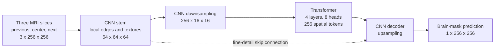
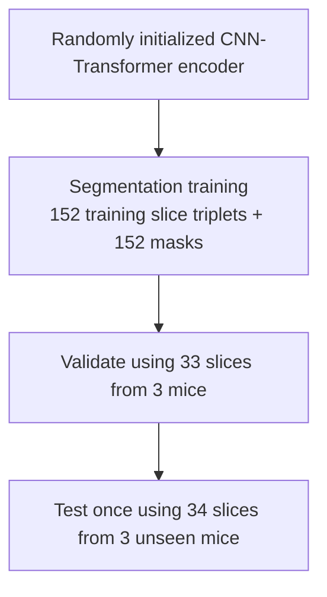
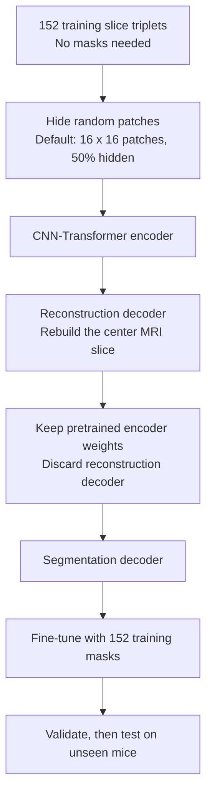

# Hybrid CNN-Transformer Model Architecture

Both experiments use the same final segmentation model. The only difference is how the encoder is initialized before segmentation training.

## Experiment 1: Hybrid model from scratch

The model starts with no MRI knowledge. It learns both image features and brain-mask prediction only from the labelled training data.

## Experiment 2: SSL-pretrained hybrid model

Here the encoder first learns general MRI anatomy by rebuilding masked images. It is then fine-tuned to segment the brain mask.

## Fair comparison

| Item | From scratch | SSL-pretrained |
|---|---|---|
| Final segmentation architecture | Same | Same |
| Training mice | Same 14 mice | Same 14 mice |
| MRI input | Same three adjacent slices | Same three adjacent slices |
| Segmentation masks | Same 152 masks | Same 152 masks |
| Initial encoder weights | Random | Learned from masked reconstruction |
| Validation and test mice | Same | Same |

Run each configuration with seeds `1`, `2`, and `3`. If the SSL-pretrained version consistently has higher test Dice than the from-scratch version, the improvement is attributable to masked-image pretraining rather than a different segmentation architecture.
